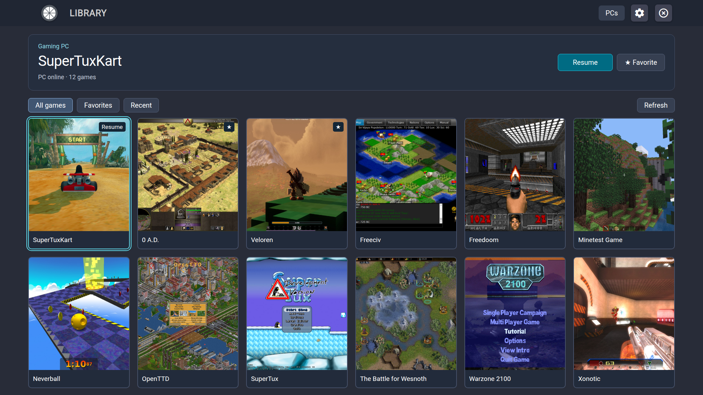
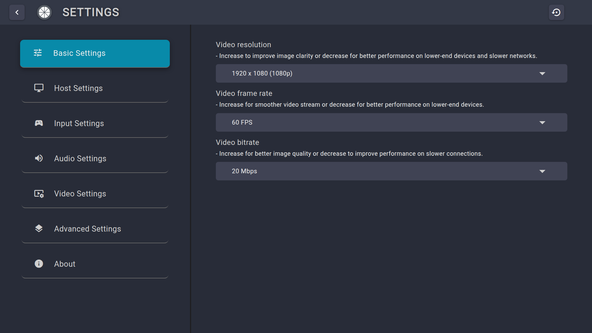

# Moonlight Tizen

A fork of [brightcraft/moonlight-tizen](https://github.com/brightcraft/moonlight-tizen) — an open-source client for NVIDIA GameStream and [Sunshine](https://app.lizardbyte.dev/Sunshine/) that streams games from your PC to a Samsung Smart TV.

## Interface



<details>
<summary>PC offline — Wake & play</summary>


</details>

<details>
<summary>Basic settings</summary>



</details>

Application UI rendered locally with the original application layout, a
demonstration PC and twelve real open-source games. Game images are reused under
their published open licenses; see [image credits and licenses](docs/images/ATTRIBUTION.md).
The online Resume and offline Wake & play states are simulated; these captures
demonstrate the interface, not gameplay or a Wake-on-LAN test on a TV.

## Why this fork

This fork focuses on smooth playback, low latency and full picture quality on Samsung TVs:

- Audio builds on the Web Audio approach from [ruanformigoni's fork](https://github.com/ruanformigoni/moonlight-tizen), now rendering in an `AudioWorklet` from a shared PCM ring away from the browser main thread.
- Video is submitted directly on a clock disciplined against the TV, whose real refresh rate is reported to the host.
- Gamepad input and rumble use coherent, coalesced state instead of blocking timing-critical paths.
- Stream cleanup prevents work from one session leaking into the next.
- A controller-first library keeps favorites, recent games and the last PC ready to
  use, with Play, Resume and Wake & play in one screen.

The implementation is capability-driven rather than tied to one TV model. Hardware
validation is currently limited to a Samsung DU7700 running Tizen 9.0, with smooth
1080p, 1440p and 4K playback. Reports from other models are welcome.

Development of this fork has been assisted by Claude Code and OpenAI Codex.

---

## Installation

Requires Tizen 5.5 or newer. Download a `.wgt` from the
[latest release](https://github.com/samirmartins/moonlight-tizen/releases/latest) and
follow this fork's [Installation Guide](INSTALLATION.md).

Two variants, identical except for one line of `config.xml` metadata:

| Build | Purpose |
|---|---|
| `Moonlight-…-samirmartins-ForceGM.wgt` | Asks the TV firmware to put the panel into Game Mode. **Recommended on the tested DU7700.** |
| `Moonlight-…-samirmartins.wgt` | The plain build, without that metadata. |

On the tested DU7700, ForceGM performed better. **With ForceGM, leave the in-app
*Game Mode* switch off.** The metadata controls the TV panel; the switch selects a
decoder mode that freezes playback on some models. Use the plain build if ForceGM
misbehaves on your TV.

Both variants of the same release share an application ID and signing identity, so one
replaces the other and keeps settings. Upgrades from older releases may be rejected if
their author certificate differs. In that case the old widget must be uninstalled first,
which removes its saved settings. Published widgets use a persistent author certificate.

---

## Recommended settings

- **Rumble feedback** defaults off for broad controller compatibility. Off also disables
  haptics at the protocol boundary. When enabled, updates are coalesced and applied after
  frame delivery.
- **Audio jitter buffer** defaults to 100 ms, but this is an adaptive ceiling rather than
  fixed latency. Playback starts near two Opus frames and raises protection after a real
  underrun, never beyond the selected value.
- **Session diagnosis** is opt-in and resets to off when the app starts. It stores only the
  latest report locally; when off, its collection work is inactive.
- **Wake & play** wakes an offline PC and launches the selected game when Sunshine is
  ready. Checking the PC does not block waking it; **Refresh** restarts the check and
  reloads games/covers. Menu requests are cancelled before streaming.
- **Wake-on-LAN** learns the PC's MAC after successful pairing; a manual override remains
  available. The MAC stays in TV storage and LAN wake packets, never in the widget or
  diagnostic telemetry. Configure WoL on the PC and its network adapter first.

---

## Network note

Some Samsung TVs have 100 Mbps Ethernet. Wired is preferable while the stream stays
comfortably below that limit; at high 4K bitrates, strong Wi-Fi through a nearby access
point with a wired uplink is worth trying.

---

## Documentation and feedback

- [Changelog](CHANGELOG.md)
- [Installation Guide](INSTALLATION.md)
- [Issues](https://github.com/samirmartins/moonlight-tizen/issues)
- [Contributing](.github/CONTRIBUTING.md)

---

## Building

```bash
docker build --ulimit nofile=1024:524288 -t moonlight-tizen .
```

The `--ulimit` is required by the bundled Tizen Studio JDK. Add
`--build-arg FORCE_GAME_MODE=1` for ForceGM. Copy the resulting widget with:

```bash
docker run --rm -v "$PWD:/out" --entrypoint sh moonlight-tizen \
  -c 'cp /home/moonlight/*.wgt /out/'
```

For the faster compile/test/package workflow and the full `--ulimit` explanation, see
[`build-tools/README.md`](build-tools/README.md).

---

## License

[GNU General Public License v3.0](LICENSE).

---

## Credits

This fork builds on work from:

- **[brightcraft](https://github.com/brightcraft/moonlight-tizen)** — for the repository this fork is based on and years of Tizen UI, feature and maintenance work.
- **[ruanformigoni](https://github.com/ruanformigoni/moonlight-tizen)** — for identifying the Tizen elementary media source as the audio problem and providing the Web Audio foundation.
- **[Moonlight Game Streaming Project](https://github.com/moonlight-stream)** — for the NVIDIA GameStream protocol implementation and the Chrome OS client.
- **[Samsung Developers Forum](https://github.com/SamsungDForum/moonlight-chrome)** — for the original WASM port to Tizen, including the video and audio pipelines built on the Tizen WASM Player.
- **[KyroFrCode](https://github.com/KyroFrCode/moonlight-chrome-tizen)** — for turning it into an installable application, and for the build method.
- **[OneLiberty](https://github.com/OneLiberty/moonlight-chrome-tizen)** — for codec selection, gamepad mouse emulation, Wake-on-LAN, and more.
- **[ToyPoodleGaming](https://github.com/toypoodlegaming/moonlight-chrome-tizen)** — for surround sound, performance statistics, and improved bitrate calculation.
- **Claude Code and OpenAI Codex** — development assistance with analysis, implementation, review, tests and documentation.

And to **every contributor** to those projects.
