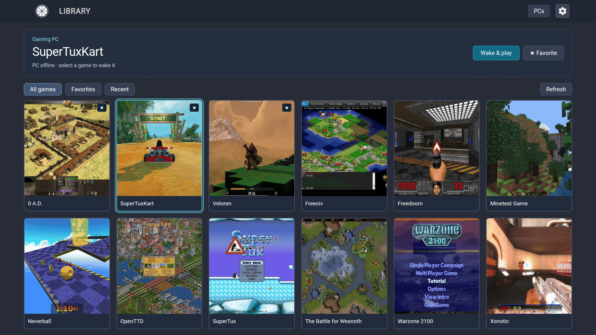

# Moonlight Tizen

A fork of [brightcraft/moonlight-tizen](https://github.com/brightcraft/moonlight-tizen) — an open-source client for NVIDIA GameStream and [Sunshine](https://app.lizardbyte.dev/Sunshine/) that streams games from your PC to a Samsung Smart TV.

## Interface



Local UI demonstration with simulated PC states and openly licensed game images;
see [image credits and licenses](docs/images/ATTRIBUTION.md).

## Why this fork

This fork focuses on smooth playback, low latency and full picture quality on Samsung TVs:

- Audio playback runs separately from the interface.
- Video timing follows the TV's refresh rate, which is reported to the host.
- Gamepad controls include optional rumble feedback.
- A controller-first library keeps favorites, recent games and the last PC ready to
  use, with Play, Resume and Wake & play in one screen.

Hardware validation is currently limited to a Samsung DU7700 running Tizen 9.0, with smooth
1080p, 1440p and 4K playback. Reports from other models are welcome.

---

## Quick start

You need a Samsung TV running Tizen 5.5 or newer and a PC running Sunshine.
Keep the TV, PC and installation device on the same local network.

1. **Download Moonlight.** Get a `.wgt` from the
   [latest release](https://github.com/samirmartins/moonlight-tizen/releases/latest).
   **ForceGM** requests TV Game Mode and is recommended on the tested DU7700;
   use the **normal** build if ForceGM causes problems on your TV. Leave
   Moonlight's in-app *Game Mode* switch **off** when using ForceGM.
2. **Install on the TV.** Enable the TV's Developer Mode and install the downloaded
   widget with Apps2Samsung, following the
   [Installation Guide](INSTALLATION.md#apps2samsung-recommended).
3. **Set up Sunshine on the PC.** Follow Sunshine's
   [Getting Started guide](https://docs.lizardbyte.dev/projects/sunshine/latest/md_docs_2getting__started.html),
   open its web interface, and add your games under **Applications**.
   You can use **Desktop** for the first connection. Keep Sunshine running.
4. **Add and pair the PC.** Open Moonlight on the TV and select your PC from **PCs**.
   If it is not listed, choose **Add Host** and enter the PC's local IP address.
   Enter the PIN shown on the TV in Sunshine's **PIN** page on the PC to complete pairing.
5. **Start playing.** Connect a gamepad to the TV, select a game or **Desktop**
   in the library, and choose **Play**. Use **Resume** to reconnect to an
   application that is already running.

---

## Installation

Choose a variant when downloading:

| Build | Purpose |
|---|---|
| `Moonlight-…-samirmartins-ForceGM.wgt` | Requests TV panel Game Mode. |
| `Moonlight-…-samirmartins.wgt` | Does not request TV panel Game Mode. |

---

## Recommended settings

- **Rumble feedback** defaults off for broad controller compatibility.
- **Audio jitter buffer** defaults to 100 ms, but this is an adaptive ceiling rather than
  fixed latency; buffering increases only when needed, up to the selected limit.
- **Session diagnosis** is opt-in and resets to off when the app starts. It stores only the
  latest report locally.

---

## Network note

Some Samsung TVs have 100 Mbps Ethernet. Wired is preferable while the stream stays
comfortably below that limit; at high 4K bitrates, strong Wi-Fi through a nearby access
point with a wired uplink is worth trying.

---

## FAQ

### How do ForceGM and the in-app Game Mode differ?

ForceGM requests Game Mode for the TV panel. The in-app switch selects the
decoder's Ultra Low Latency mode, which can freeze video on some models.
Leave the switch **off** when using ForceGM; it does not disable the panel request.

### How do I set up Wake & play?

Enable Wake-on-LAN on the PC and its network adapter, then pair Moonlight while
the PC is online so it can learn the adapter's MAC address. When the PC is offline,
select a cached game and choose **Wake & play**. If prompted, enter the physical
LAN adapter's MAC and choose **Save MAC**. Sunshine must be available after the
PC wakes. **Checking PC** does not block the wake action; **Refresh** reloads the
library. The MAC stays in TV storage and LAN wake packets.

### What if the PC does not appear or pairing fails?

Follow the manual **Add Host** and PIN steps in [Quick start](#quick-start).
If the pairing dialog says the PC is busy, stop its running streaming application
before retrying. For other errors, check Sunshine's **Troubleshooting** logs.

### Can I update without losing settings?

Install the new WGT over the existing app using the same installation method and,
if re-signing, the same author certificate. Settings are retained when the
application ID and author certificate match; normal and ForceGM builds of the same
release share both. If installation fails because an older author certificate
differs, uninstalling the old app before reinstalling removes its saved settings.
See [Updates](INSTALLATION.md#updates).

---

## Documentation and feedback

- [Changelog](CHANGELOG.md)
- [Installation Guide](INSTALLATION.md)
- [Issues](https://github.com/samirmartins/moonlight-tizen/issues)
- [Contributing](.github/CONTRIBUTING.md)

---

## Building

```bash
docker build --ulimit nofile=1024:524288 -t moonlight-tizen .
```

The `--ulimit` is required. See the [build guide](build-tools/README.md) for
ForceGM, widget extraction, tests and signing.

---

## License

[GNU General Public License v3.0](LICENSE).

---

## Credits

This fork builds on work from:

- **[brightcraft](https://github.com/brightcraft/moonlight-tizen)** — base repository and Tizen UI.
- **[ruanformigoni](https://github.com/ruanformigoni/moonlight-tizen)** — Web Audio foundation.
- **[Moonlight Game Streaming Project](https://github.com/moonlight-stream)** — GameStream protocol and Chrome OS client.
- **[Samsung Developers Forum](https://github.com/SamsungDForum/moonlight-chrome)** — original WASM port to Tizen.
- **[KyroFrCode](https://github.com/KyroFrCode/moonlight-chrome-tizen)** — installable application and build method.
- **[OneLiberty](https://github.com/OneLiberty/moonlight-chrome-tizen)** — codec selection, gamepad mouse emulation and Wake-on-LAN.
- **[ToyPoodleGaming](https://github.com/toypoodlegaming/moonlight-chrome-tizen)** — surround sound, statistics and bitrate calculation.
- **Claude Code and OpenAI Codex** — development, review, testing and documentation assistance.

And to **every contributor** to those projects.
